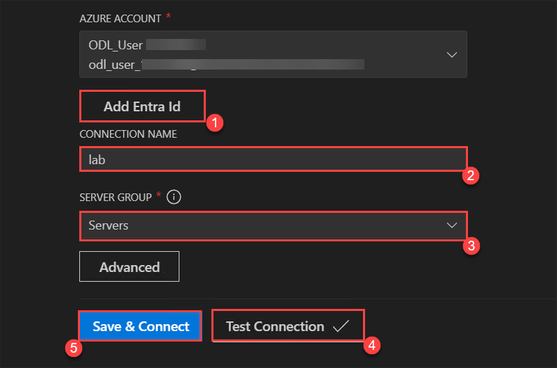

# Lab 1: PostgreSQL and SK Agents

Large-Language Models (LLMs) enhance applications with semantic capabilities, such as natural language search. This lab will guide you to develop an agent-driven, Retrieval-Augmented Generation (RAG) application to explore the U.S. Case Law dataset for factual information.

You will gain hands-on experience in building an agent-based app using Azure Database for PostgreSQL, Visual Studio Code, and the Semantic Kernel Agent Framework. This course will not only cover these technologies but also delve into AI and information retrieval techniques in practice, such as database vectors for (LLMs) and the DiskANN index for vector search. Additionally, you will learn how to integrate the GraphRAG pattern using Apache AGE for PostgreSQL, an extension that adds graph database functionality to PostgreSQL, leveraging the Semantic Kernel Agent Framework.

In Part 1, we will set up and populate the data in the database, as well as the Azure AI extension, and test the tools that we will use. Part 2 explores how to perform text searches using pattern matching, and demonstrates in practice how this can be significantly improved by relying on semantic vector search and vector indexes. In Part 3, we delve deeply into creating an agent that uses the GraphRAG pattern, a technique designed to improve the quality of results by extracting knowledge graph information from our data. Let's get started!

## Task 1 - Setup your Azure PostgreSQL Database for your Agentic App

1. On the Azure Portal landing page, search for Resource Groups and select Resource Groups from the list.

   

1. Select SKAgents<inject key="Deployment ID" enableCopy="false"/> Resource group.

   

1. Verify that the Azure Open AI and Azure Database for PostgreSQL flexible server have been created. Select the PostgreSQL Flexible Server instance.

   

1. From the left panel, select  Authentication under Security. Verify that the Authentication method is set to Microsoft Authentication Method only. Click on Add Microsoft Entra Administrators.

   

1. In the window that appears, search for <inject key="AzureAdUserEmail"></inject> and select checkbox and click on Select. 

   

1. Review that the <inject key="AzureAdUserEmail"></inject> has been selected and click on Save. 

   

1. Wait until the deployment gets completed. 

   

1. On your LabVM Desktop, Double click the VS Code icon to Open VS Code. 

1. Once inside VS Code, click the Elephant Icon on the left navigation. Once the extension loads, click the "Add Connection" button in the "POSTGRESQL" panel

   

1. Select the input type option as "Browse Azure".

    

1. This will prompt a popup to ask to login to Azure, click "Allow"

    

1. Login with your Lab Credentials

    - Username: <inject key="AzureAdUserEmail"></inject>

      

    - Password: <inject key="AzureAdUserPassword"></inject>

      

1. Click "Yes, all apps"

    

1. Click "Done"

   

1. Back on the "Connection Dialog", for each of the options, click each drop down and select the following options:
    1. Subscription: Select the only option provided
    2. Resource Group: Select the only option provided
    3. Location: Select the only option provided
    4. Server: Select the only option provided
    5. Database: Select `cases`
    6. Authentication Type: Entra Auth

   

1. Continue to Fill the Following Options on the "Connection Dialog"

   1. Click **"Add Entra ID"**.
   2. Select your previously logged-in **Lab Account**. Once the confirmation window appears, close the browser tab.
   3. Ensure your Lab account is now selected as the **"Azure Account"**.
   4. Enter the **Connection Name** as `lab`.
   5. Leave the **Server Group** to the default value.
   6. Click **"Test Connection"** to verify connectivity.
   7. Click **"Connect"** to finalize the connection.

   - **Note:** Wait for sometime for the connection to establish

   
   

## Task 2: Launch PSQL Command Line Shell in VS Code

1. On the VS Code, click on Files from the top left corner and select Select Folder.

    

1. Navigate to `C:\LabFiles` and select the `pg-sk-agents-lab` folder.

    

1. Select "I trust the authors"  

   

1. Click on the Elephant icon from the left. Expand the connection `lab`. 
   - Note: If a pop appears asking you to signin, select the previously logged in Lab Account and close the browser tab once logged in.

   

1. In the Object Explorer panel in the top left part of the screen, expand the "Databases" node. Right click the database named "Cases" and Select the option "Connect with PSQL"

   

1. This will open the PSQL Command Line Shell in the VS Code Terminal. Once PSQL loads, you should see a command line shell like `cases=>`

   

1. To confirm we are in the correct folder context, enter the command: `\! cd`.

   


1. At the PSQL Command Line Shell, run the following command to add a couple of tables to the cases database and populate them with sample data.
   
   ```
   \i ./Scripts/initialize_dataset.sql;
   ```
   

1. Execute the following command to allow the extended display to be automatically applied.

   ```
   \x auto
   ```   
      
   
1. We will retrieve a sample of data from the cases table in our cases dataset. This allows us to examine the structure and content of the data stored in the database.

   ```
   SELECT name FROM cases LIMIT 5;
   ```
     
 
1. Execute the following command in **VS Code PSQL Command Line Shell** to verify the extensions in your server's *allowlist* 

   ```
   SHOW azure.extensions;
   ```
     

1. Search Powershell in the Search bar of your LabVM and select Powershell. 
1. Execute the command `cd C:\LabFiles\pg-sk-agents-lab\scripts\` to navigate to the scripts folder.
1. Execute the following command to run the script to fetch details.

   ```
   .\get_env.ps1
   ```
1. Copy the values for `AZURE_OPENAI_ENDPOINT` and `AZURE_OPENAI_KEY` from the output and paste in into a notepad. 

1. Go back to VS Code and the PSQL Command Shell, then use the commands below to add your values to the configuration table. Ensure to replace {AZURE_OPENAI_ENDPOINT} and {AZURE_OPENAI_KEY} tokens with the values you copied in the earlier step.

   ```
   SELECT azure_ai.set_setting('azure_openai.endpoint', '{AZURE_OPENAI_ENDPOINT}');
   ```
   ```
   SELECT azure_ai.set_setting('azure_openai.subscription_key', '{AZURE_OPENAI_KEY}');
   ``` 

1. Verify the settings written into the azure_ai.settings table using the following queries:

   ```
   SELECT azure_ai.get_setting('azure_openai.endpoint');
   ```

   ```
   SELECT azure_ai.get_setting('azure_openai.subscription_key');
   ```   

1. Run the following query, which creates a vector embedding for a sample query. The **deployment_name** parameter in the function is set to **embedding**, which is the name of the deployment of the **text-embedding-3-small** model in your Azure OpenAI service:

   ```
   SELECT LEFT(azure_openai.create_embeddings('text-embedding-3-small', 'Sample text for PostgreSQL Lab')::text, 100) AS vector_preview;
   ```

## Task 3 - Using AI-driven features in Postgres

In this section, we will explore how to leverage AI-driven features within PostgreSQL to enhance data processing and analysis. These features can help automate tasks, improve data insights, and provide advanced functionalities that traditional SQL queries may not offer.

1. On the VS Code, expand the Databases Node, and Right Click on `cases` database, select `New Query` option.


1. This will open a new query editor window like below. Notice on the bottom right, you can see a green circle indicating you are successfully connected to cases database.

1. Enter the following SQL query below in the query editor to run a test query.

   ```
   SELECT NAME FROM CASES LIMIT 5;
   ```   
    
1. Next click the green play ">" icon in the top right tool bar. Notice the results open in PostgreSQL Query Results panel.
    

1. We will start by searching for cases mentioning `"Water leaking into the apartment from the floor above."` to perform case-insensitive searches within text fields.

   ```
   SELECT id, name, opinion
   FROM cases
   WHERE opinion ILIKE '%Water leaking into the apartment from the floor above';
   ```
   > Note: It does not find any results because those *exact* words are not mentioned in the opinion. As you can see there are no results for what to user wants to find. We need to try another approach.


## Task 4: Using Semantic Vector Search and DiskANN Index

In this section, we will focus on generating and storing embedding vectors.  We are going to use these in our Agent App in later steps. Embedding vectors represent data points in a high-dimensional space, allowing for efficient similarity searches and advanced analytics.
Now that we have some sample data, it's time to generate and store the embedding vectors. The <code spellcheck="false">azure_ai</code> extension makes calling the Azure OpenAI embedding API easy.

1. Now, you are ready to install the vector extension.

    ```sql
    CREATE EXTENSION IF NOT EXISTS vector;
    ```

1. Add the embedding vector column. The <code spellcheck="false">text-embedding-3-small</code> model is configured to return 1,536 dimensions, so use that for the vector column size.

    ```sql
    ALTER TABLE cases ADD COLUMN opinions_vector vector(1536);
    ```

1. Generate an embedding vector for the opinion of each case by calling Azure OpenAI through the create_embeddings user-defined function, which is implemented by the azure_ai extension:

    ```sql
    UPDATE cases
    SET opinions_vector = azure_openai.create_embeddings('text-embedding-3-small',  name || LEFT(opinion, 8000), max_attempts => 5, retry_delay_ms => 500)::vector
    WHERE opinions_vector IS NULL;
    ```

    >Note: This may take several minutes to run.

1. Adding an DiskANN Vector Index to improve vector search speed. 

    ```sql
    CREATE EXTENSION IF NOT EXISTS pg_diskann;
    ```
1. Create the diskann index on a table column that contains vector data. As you scale your data to millions of rows, DiskANN makes vector search more efficient.

    ```sql
    CREATE INDEX cases_cosine_diskann ON cases USING diskann(opinions_vector vector_cosine_ops);
    ```

1. See an example vector by running the below query.The output will take up alot of your screen, just hit enter to move down the page to see all of the output:

    ```sql
    SELECT opinions_vector FROM cases LIMIT 1;
    ```
    >Note: The output will take up alot of your screen, just hit enter to move down the page to see all of the output

## Task 5: Perform a Semantic Search Query

Now that you have listing data augmented with embedding vectors, it's time to run a semantic search query. To do so, get the query string embedding vector, then perform a cosine search to find the cases whose opinions that are most semantically similar to the query.

1. Generate the embedding for the query string.

    ```sql
    SELECT azure_openai.create_embeddings('text-embedding-3-small', 'Water leaking into the apartment from the floor above.');
    ```

2. Use the embedding in a cosine search, fetching the top 10 most similar cases to the query.

    ```sql
    SELECT id, name
    FROM cases
    ORDER BY opinions_vector <=> azure_openai.create_embeddings('text-embedding-3-small', 'Water leaking into the apartment from the floor above.')::vector 
    LIMIT 10;
    ```

3. You may also project the <code spellcheck="false">opinion</code> column to be able to read the text of the matching rows whose opinions were semantically similar. For example, this query returns the best match:

    ```sql
    SELECT id, opinion
    FROM cases
    ORDER BY opinions_vector <=> azure_openai.create_embeddings('text-embedding-3-small', 'Water leaking into the apartment from the floor above.')::vector 
    LIMIT 1;
    ```

