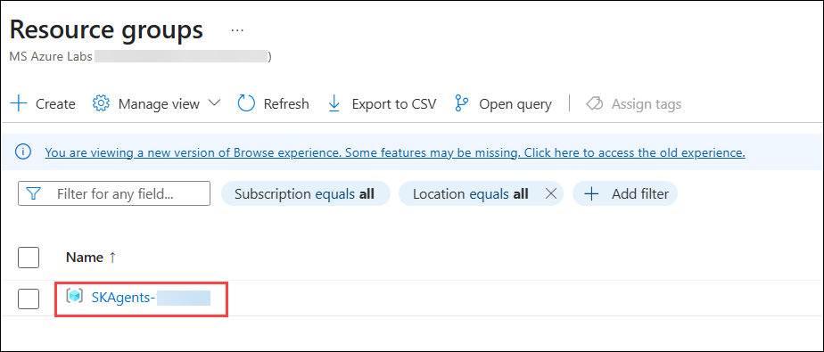
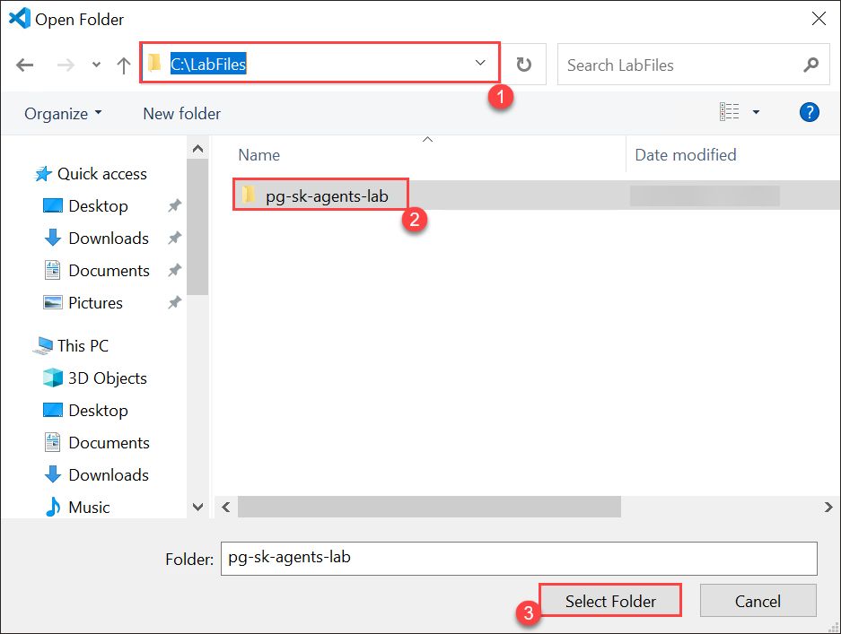
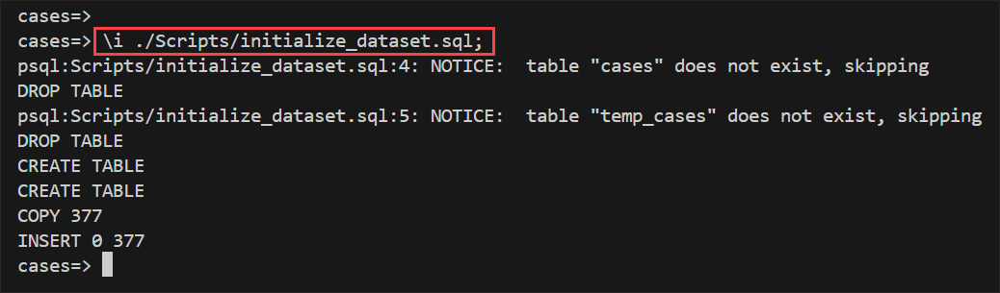
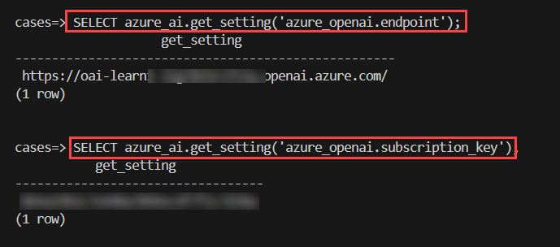
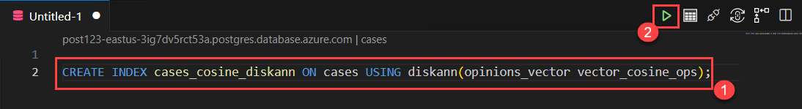

# Lab 1 - PostgreSQL Connection and AI Search Integration

### Estimated time: 120 minutes

This lab focuses on establishing a connection between Visual Studio Code and a PostgreSQL database, launching the PSQL command-line shell, and integrating AI-driven semantic search capabilities. It involves configuring Azure AI extensions, generating and storing embedding vectors using the Azure OpenAI embedding API, and implementing semantic vector search with the DiskANN index for high-performance similarity queries. The lab demonstrates how to enhance traditional text search with advanced semantic search techniques and prepares data environments for agent-based AI applications by combining structured data, vector embeddings, and AI-powered search queries within PostgreSQL.

## Task 1: Setup your Azure PostgreSQL Database

In this task, you will connect a PostgreSQL Flexible Server on Azure to VS Code using Entra ID authentication. This includes assigning an administrator and configuring a secure database connection through the VS Code PostgreSQL extension.

1. On the Azure portal home page, search for **Resource groups(1)** in the search bar and select **Resource groups(2)** from the results.

   

1. Select the **SKAgents-<inject key="Deployment ID" enableCopy="false"/>** resource group.

   

1. Verify that the **Azure OpenAI** and **Azure Database for PostgreSQL Flexible Server** resources have been created. Then, select the **PostgreSQL Flexible Server instance**.

   

1. From the left panel, select **Authentication (1)** under Security. Verify that the authentication method is set to **Microsoft Authentication Method only (2)**. Then, click **Add Microsoft Entra Administrators (3)**.

   

1. In the window that appears, search for **<inject key="AzureAdUserEmail"></inject>**, select the **checkbox (2)** next to it, and click **Select(3)**.

   

1. Confirm that **<inject key="AzureAdUserEmail"></inject>(1)** is selected, then click **Save(2)**.

   

1. Wait for the deployment to complete.

   

1. On your LabVM desktop, double-click the VS Code icon to open Visual Studio Code.

1. Once inside VS Code, click the **Elephant icon (1)** in the left navigation panel. After the extension loads, click the **Add Connection (2)** button in the POSTGRESQL panel.

   

1. Select **Browse Azure** as the input type option.

    

1. A pop-up will appear prompting you to sign in to Azure. Click **Allow**.

    

1. Login with your Lab Credentials

    - **Username:** <inject key="AzureAdUserEmail"></inject>

      

    - **Password:** <inject key="AzureAdUserPassword"></inject>

      

1. Click **Yes, all apps**.

    

1. Click **"Done"**.

   

1. Back on the "Connection Dialog", for each of the options, click each drop down and select the following options:
    - Subscription: Select the **default Subscription provided (1)**.
    - Resource Group: Select the **SKAgents-<inject key="Deployment ID" enableCopy="false"/> (2)** RG.
    - Location: Select the **default location (3)**.
    - Server: Select the default server that appears **(4)**.
    - Database: Select **cases (5)**.
    - Authentication Type: Select **Entra Auth (6)**.

   

1. Continue to Fill the Following options on the "Connection Dialog"

    - Click **Add Entra ID (1)**.
    - Select your previously logged-in **Azure Account**. Once the confirmation window appears, close the browser tab.
    - Ensure your Lab account is now selected as the **"Azure Account"**.
    - Enter the **Entra Username** as **<inject key="AzureAdUserEmail"></inject> (2)**
    - Enter the **Connection Name** as **lab<inject key="Deployment ID" enableCopy="false"/> (3)**.
    - Leave the **Server Group (4)** to the default value.
    - Click **Test Connection (5)** to verify connectivity.
    - Click **Save and Connect (6)** to finalize the connection.

      - **Note:** Wait for sometime for the connection to establish.

   

> **Congratulations** on completing the task! Now, it's time to validate it. Here are the steps:
> - Hit the Validate button for the corresponding task. If you receive a success message, you can proceed to the next task.
> - If not, carefully read the error message and retry the step, following the instructions in the lab guide. 
> - If you need any assistance, please contact us at cloudlabs-support@spektrasystems.com. We are available 24/7 to help you out.

<validation step="a5e3a8ae-6d7f-4145-937b-328c16b91ee1" />  
   
## Task 2: Launch PSQL Command Line Shell in VS Code

In this task, you initialize the database with sample tables and data, configure Azure OpenAI endpoint and key settings, and verify them through SQL queries. Finally, you test the AI integration by generating a sample embedding vector using Azure OpenAI within the PostgreSQL database.

1. In VS Code, click **File (1)** in the top left corner and select **Open Folder (2)**.

    

1. Navigate to **C:\LabFiles(1)**, select the **pg-sk-agents-lab(2)** folder, and click on **Select Folder(3)**.

    

1. Select "Yes,I trust the authors".

   

1. Expand the **Scripts folder(1)**, open **get_env.ps1(2)**, update the Resource Group name as **SKAgents-<inject key="Deployment ID" enableCopy="false"/>(3)**, and save the file.

   

1. Minimise VS Code and on the Lab VM, search for **Powershell(1)** in the search bar and select **Windows PowerShell(2)**.

    

1. Execute the command below to log in to Azure.

   ```
   az login
   ```
   

1. On the window that appears, select the Azure account **<inject key="AzureAdUserEmail"></inject>(1)** that was used to log in earlier and click on **Continue(2)**.

   

1. Back in the terminal, type **1** and press **Enter** to select the default subscription that appears.

   

1. Execute the below command to navigate to the scripts folder.
  
   ```
   cd C:\LabFiles\pg-sk-agents-lab\scripts\
   ```
   
1. Execute the command below to navigate to the **Scripts** folder.

   ```
   .\get_env.ps1
   ```
1. Copy the values of `AZURE_OPENAI_ENDPOINT` and `AZURE_OPENAI_KEY` from the output and paste in into a notepad for further use and close the terminal, please see the below screenshot for reference.

   

1. Maximize **VS Code**. Click on the **Elephant icon(1)** from the left. Expand the connection **lab(2)**.  
   - **Note:** If a pop-up appears asking you to sign in, select the previously logged-in Azure account and close the browser tab once signed in.

   

1. In the **Object Explorer panel** at the top left of the screen, expand the **Databases(1)** node. Right-click the database named **cases(2)** and select the option **Connect with PSQL(3)**.

   

1. This will open the **PSQL Command Line Shell** in the **VS Code Terminal**. Once PSQL loads, you should see a command line prompt like **`cases=>`**.

   

1. To confirm you are in the correct folder context, enter the command: `\! cd`.

    

1. At the **PSQL Command Line Shell**, run the following command to add a couple of tables to the **Cases** database and populate them with sample data.
   
   ```
   \i ./Scripts/initialize_dataset.sql;
   ```
   

1. Execute the following command to allow the extended display to be automatically applied.

   ```
   \x auto
   ```   
      
   
1. Retrieve a sample of data from the **cases** table in the dataset. This allows you to examine the structure and content of the data stored in the database.

   ```
   SELECT name FROM cases LIMIT 5;
   ```
     
 
1. Execute the following command in **VS Code PSQL Command Line Shell** to verify the extensions in your server's allowlist.

   ```
   SHOW azure.extensions;
   ```
     

1. Run the below command to install azure_ai extension.

   ```
   CREATE EXTENSION IF NOT EXISTS azure_ai;
   ```

   
    
1. Execute the commands below to add values to the **configuration table**. Ensure you replace **{AZURE_OPENAI_ENDPOINT}** and **{AZURE_OPENAI_KEY}** with the values you copied in the earlier step.

   ```
   SELECT azure_ai.set_setting('azure_openai.endpoint', '{AZURE_OPENAI_ENDPOINT}');
   ```
   ```
   SELECT azure_ai.set_setting('azure_openai.subscription_key', '{AZURE_OPENAI_KEY}');
   ``` 
        

1. Verify the settings written into the azure_ai.settings table using the following queries:

   ```
   SELECT azure_ai.get_setting('azure_openai.endpoint');
   ```

   ```
   SELECT azure_ai.get_setting('azure_openai.subscription_key');
   ```   

       

1. Run the following query to create a vector embedding for a sample text. The **deployment_name** parameter in the function is set to **embedding**, which is the name of the deployment for the **text-embedding-3-small** model in your Azure OpenAI service.

   ```
   SELECT LEFT(azure_openai.create_embeddings('text-embedding-3-small', 'Sample text for PostgreSQL Lab')::text, 100) AS vector_preview;
   ```
         

## Task 3: Using AI-driven features in Postgres

In this task, you will explore how to leverage **AI-driven features within PostgreSQL** to enhance data processing and analysis. These capabilities help automate tasks, improve data insights, and provide advanced functionalities beyond traditional SQL queries.

1. In **VS Code**, expand the **Databases** node, right-click on the **cases(1)** database, and select the **New Query(2)** option.

    

1. This will open a **new query editor window**. Notice the **green circle** at the bottom right, indicating you are successfully connected to the **cases** database.

1. Enter the following **SQL query(1)** in the query editor and **run the query(2)**. Notice the results appear in the **PostgreSQL Query Results** panel.

   ```
   SELECT NAME FROM CASES LIMIT 5;
   ``` 

     

1. We will start by searching for cases mentioning **"Water leaking into the apartment from the floor above."** to perform case-insensitive searches within text fields. Paste the **query(1)** below into the **query editor** and run the **query(2)**.
 
   ```
   SELECT id, name, opinion
   FROM cases
   WHERE opinion ILIKE '%Water leaking into the apartment from the floor above';
   ```
    

   > Note: It does not return any results because those exact words are not mentioned in the opinion. As you can see, there are no results for what the user wants to find.

## Task 4: Using Semantic Vector Search and DiskANN Index

In this task, we will focus on generating and storing **embedding vectors**. We are going to use these in our **Agent App** in later steps. Embedding vectors represent data points in a high-dimensional space, allowing for efficient similarity searches and advanced analytics.
Now that we have some sample data, it's time to generate and store the embedding vectors. The `<code spellcheck="false">azure_ai</code>` extension makes it easy to call the **Azure OpenAI embedding API**.

1. On the **Query Editor**, you are now ready to install the **vector extension**. Paste the **query(1)** below into the **query editor** and run the **query(2)**.

    ```sql
    CREATE EXTENSION IF NOT EXISTS vector;
    ```
    

1. Add the **embedding vector column**. The `<code spellcheck="false">text-embedding-3-small</code>` model is configured to return **1,536 dimensions**, so use that for the vector column size. Paste the **query(1)** below into the **query editor** and run the **query(2)**.

    ```sql
    ALTER TABLE cases ADD COLUMN opinions_vector vector(1536);
    ```

    

1. Generate an **embedding vector** for the opinion of each case by calling **Azure OpenAI** through the `create_embeddings` user-defined function, which is implemented by the **azure_ai extension**. Paste the **query(1)** below into the **query editor** and run the **query(2)**.

    ```sql
    UPDATE cases
    SET opinions_vector = azure_openai.create_embeddings('text-embedding-3-small',  name || LEFT(opinion, 8000), max_attempts => 5, retry_delay_ms => 500)::vector
    WHERE opinions_vector IS NULL;
    ```
    

   > **Note:** This may take several minutes to run.

1. Paste the **query(1)** below into the **query editor** and run the **query(2)** to add a **DiskANN Vector Index** for improving vector search speed.

    ```sql
    CREATE EXTENSION IF NOT EXISTS pg_diskann;
    CREATE EXTENSION IF NOT EXISTS age;
    ```

    

1. Run the query below to create the **DiskANN index** on a table column containing vector data. As your data scales to millions of rows, **DiskANN** improves vector search efficiency.

    ```sql
    CREATE INDEX cases_cosine_diskann ON cases USING diskann(opinions_vector vector_cosine_ops);
    ```
    

1. Run the query below to see an example vector

    ```sql
    SELECT opinions_vector FROM cases LIMIT 1;
    ```
    > **Note:** The output will take up alot of your screen, just hit enter to move down the page to see all of the output

    

## Task 5: Perform a Semantic Search Query

In this task, we will use the existing data augmented with embedding vectors to run a semantic search query. To do this, we will get the query string’s embedding vector and then perform a cosine search to find the cases whose opinions are most semantically similar to the query.

1. Run the query below to generate the embedding for the query string.

    ```sql
    SELECT azure_openai.create_embeddings('text-embedding-3-small', 'Water leaking into the apartment from the floor above.');
    ```

    

2. Run the below query to use the embedding in a cosine search to fetch the top 10 most similar cases to the query.

    ```sql
    SELECT id, name
    FROM cases
    ORDER BY opinions_vector <=> azure_openai.create_embeddings('text-embedding-3-small', 'Water leaking into the apartment from the floor above.')::vector 
    LIMIT 10;
    ```

    

3. Run the below query to project the `<code spellcheck="false">opinion</code>` column, allowing you to read the text of the matching rows whose opinions were semantically similar. For example, this query returns the best match.

    ```sql
    SELECT id, opinion
    FROM cases
    ORDER BY opinions_vector <=> azure_openai.create_embeddings('text-embedding-3-small', 'Water leaking into the apartment from the floor above.')::vector 
    LIMIT 1;
    ```

    


## Review

In this lab, you have accomplished the following:

- Established connectivity from VS Code to the Azure PostgreSQL Flexible server.
- Launched and ran commands on PSQL Command Line Shell
- Ran Semantic Search Query

## You have successfully finished the lab. Click Next to continue to the next lab.

