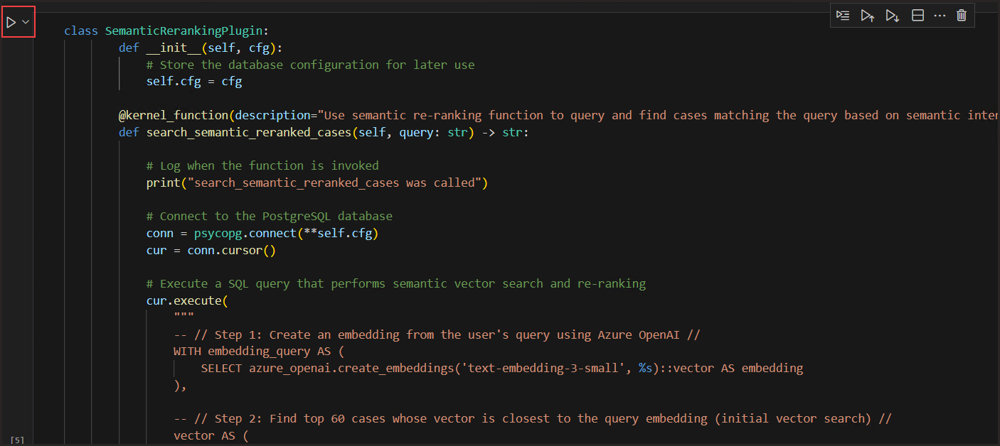

# Lab 2 - Build the Agentic App

Next, we are going to take everything we have learned so far and now build our Agentic App. For the remainder of this lab, you will work in a Python Jupyter Notebook in VS Code. you will build a Semantic Kernel Agent that can reason over our database of legal cases you deployed in the previous steps. You will also incorporate external web service data, and use memory to improve its responses over time.

## Task 1: Open the Notebook

1. Click the "Files" icon in the left navigation bar of VS Code to return to the "Explorer" View. Expand the `Code` folder and look for a file name `lab.ipynb`

       

1. To setup the Kernal, click on kernel and click on Select Another Kernel.

   
   
1. Select Python Environments and then select Python 3.10.0. 

   

   

1. Run the first cell under Part 3.2, we are importing necessary modules.

   

1. Within VS Code,select the ellipses,select terminal and click on new terminal.

    

 1. On the terminal, execute the below command to fetch the values of AZURE_OPENAI_ENDPOINT AZURE_OPENAI_KEY,DB_CONFIG - HOST and DB_CONFIG - PASSWORD. Copy and paste these values into a notepad.
    ```
    .\Scripts\get_env.ps1
    ```
    

1. Navigate back to the lab.ipynb file and update the values in the Part 3.3 cell with the given below values.Run the cell after updating the values.
   - AZURE_OPENAI_ENDPOINT : Paste the value of AZURE_OPENAI_ENDPOINT that you copied in the previous step
   - AZURE_OPENAI_KEY: Paste the Value of AZURE_OPENAI_KEY that you copied in the previous step.
   - host: Paste the value of DB_CONFIG - HOST you copied in the previous step
   - user: Enter <inject key="AzureAdUserEmail"></inject>
   - password: Paste the value of DB_CONFIG - PASSWORD that you copied in the previous step.
   > Note: For DB_CONFIG - PASSWORD, this is a very long string due to being an Entra ID Access Token, be sure to copy the entire string as the password.
    

1. Now run the 3.4 cell.     
    
1. Now run the 3.5 cell and observe the output    
    
    

1. In VS Code, in the folder structure, in the folder, expand the folder Scripts. Open the file  setup_reranker.sql. Once inside the file, still in VS Code, press on the keyboard CTRL+SHIFT+C to open the VS Code action panel, select the Connection you made in the earlier steps in the lab.   
    

1. Verify that You are Connected to your database in the setup_reranker.sql file. Now, Replace AZURE_OPENAI_KEY with the Value of AZURE_OPENAI_KEY that you copied in the previous step and replace AZURE_OPENAI_ENDPOINT with the value of AZURE_OPENAI_ENDPOINT that you copied in the previous step. Run the sql file after updating the values.
    

1. Run the cell 3.6
    
1. In VS Code, in the folder structure, in the folder Scripts , open the create_graph.sql file.
Once inside the file, still in VS Code, press on the keyboard CTRL+SHIFT+C to open the VS Code action panel, select the Connection you made in the earlier steps in the lab.
    
1. Verify that You are Connected to your database in the create_graph.sql file and run the query.
    

1. In VS Code, in the folder structure, in the folder Scripts , open the load_age.ps1 file. Replace the Resource Group Name with SKAgents<inject key="Deployment ID" enableCopy="false"/>

   

1. Within VS Code,select the ellipses,select terminal and click on new terminal.
    
1. Execute the below command 
   ```
   .\Scripts\load_age.ps1
   ``` 
   > Note: This will run through 3 main commands, all together will take around 60-120 seconds.  

   

1. Run the cell Part 3.7
    
1. Run the cell Part 3.8 and observe the output.     
       
    
1. Run the cell 3.9    
    
1. Run the cell 3.10 and observe the output.    
    
    
1. Run the cell 3.11 and observe the output.     
    
    


