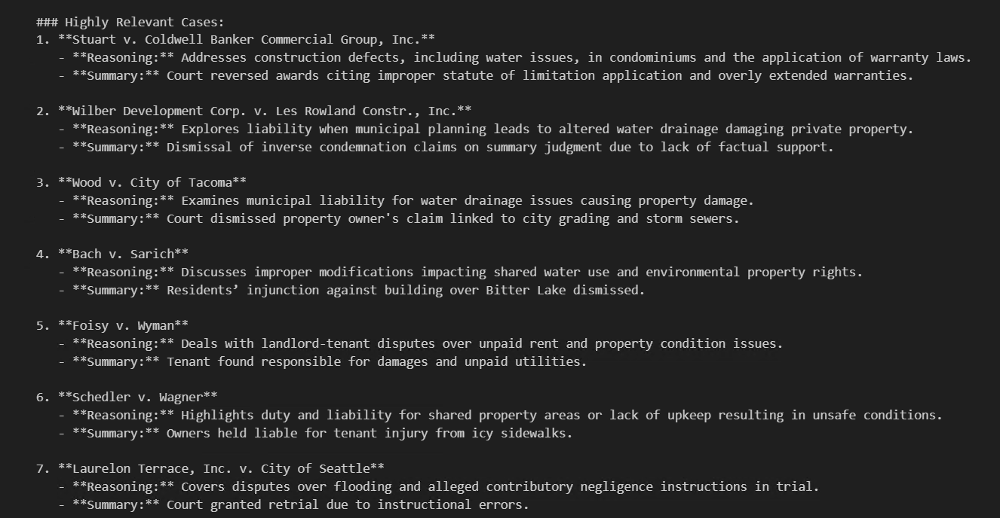

# Lab 2 - Build a Semantic Kernel Agent

### Estimated time: 120 minutes

In this lab, you will take everything learned so far and build our Agentic App. You will work in a Python Jupyter Notebook in VS Code to create a Semantic Kernel Agent that can reason over the legal cases database deployed earlier. Additionally, you will incorporate external web service data and use memory to improve the agent’s responses over time.

## Task 1: Agent App Setup and Plugin Integration

In this task, we will create and test multiple plugins including DatabaseSearchPlugin, SemanticRerankingPlugin, GraphDatabasePlugin, and WeatherPlugin to enhance the agent’s capabilities, then enable semantic memory and reassemble the agent for final testing.

1. Click the **Files(1)** icon in the left navigation bar of VS Code to return to the **Explorer** view. Expand the **`Code`** folder and look for the file named **lab.ipynb(2)**.

       

1. To set up the kernel, click on **Kernel** and then select **Select Another Kernel**.

   
   
1. Select **Python Environments** and then choose **Python 3.10.0**.

   

   

## You can now proceed with running the `lab.ipynb` file to continue with the lab. If you encounter any confusion, please refer to the lab guide starting from here

1. Run the first cell under **Part 3.2: Setup the Agent App Python imports**. This step imports the necessary modules, preparing the technical foundation for building an AI-powered agent that interacts with a **PostgreSQL database** and **OpenAI services**.

   

1. Within **VS Code**, select the **ellipses(1)**, then select **Terminal(2)**, and click on **New Terminal(3)**.

    

 1. On the terminal, execute the command below to fetch the values of **AZURE_OPENAI_ENDPOINT**, **AZURE_OPENAI_KEY**, **DB_CONFIG - HOST**, and **DB_CONFIG - PASSWORD**. Copy and paste these values into a notepad for later use.

    ```
    .\Scripts\get_env.ps1
    ```
    

1. Navigate back to the **lab.ipynb** file and update the values in the **Part 3.3: Setup environmental connection variables** cell with the values listed below. **Run** the cell after updating the values.

   - **AZURE_OPENAI_ENDPOINT**: Paste the value of **AZURE_OPENAI_ENDPOINT** that you copied in the previous step **(1)**.
   - **AZURE_OPENAI_KEY**: Paste the value of **AZURE_OPENAI_KEY** that you copied in the previous step **(2)**.
   - **host**: Paste the value of **DB_CONFIG - HOST** that you copied in the previous step **(3)**.
   - **user**: Enter **<inject key="AzureAdUserEmail"></inject>** **(4)**.
   - **password**: Paste the value of **DB_CONFIG - PASSWORD** that you copied in the previous step **(5)**.

   > **Note:** For **DB_CONFIG - PASSWORD**, this is a very long string due to being an **Entra ID Access Token** — be sure to copy the entire string as the password.

   

1. Now run the **Part 3.4: Create Semantic Kernel Plugin for Basic Database Queries** cell. In this step, we create a custom plugin called **DatabaseSearchPlugin** to give our agent the ability to interact directly with the **case law database** using basic SQL queries.
 
   

1. Now run the **Part 3.5: Test Run of our New Agent** cell. Now that we have created our first plugin, we're ready to assemble and test an initial version of our agent. Observe the output and notice how we asked for **10 cases**, but only got **2**.
  
   
   

1. In **VS Code**, in the folder structure, expand the folder **Scripts(1)**, open the file **setup_reranker.sql(2)**, press **CTRL+SHIFT+C** to open the **VS Code action panel**, and select the connection named **lab(3)** that you created in the earlier steps of the lab.

   

1. Verify that you are **connected(1)** to your database in the **setup_reranker.sql** file. Now, replace **AZURE_OPENAI_KEY** with the value of **AZURE_OPENAI_KEY(2)** that you copied in the previous step, and replace **AZURE_OPENAI_ENDPOINT** with the value of **AZURE_OPENAI_ENDPOINT(3)** that you copied in the previous step. **Run(4)** the SQL file after updating the values.

    

1. Run the cell under **Part 3.6: Improve Agent Accuracy by Adding Semantic Re-ranking Query Plugin**. In this step, we add a new plugin called **SemanticRerankingPlugin** to increase the precision of our agent’s search results.

   

   >**Note:** This cell might take 5-6 mins to run. 

1. In **VS Code**, in the folder structure, expand the folder **Scripts(1)**, open the **create_graph.sql(2)** file, press **CTRL+SHIFT+C** to open the **VS Code action panel**, and select the connection named **lab(3)** that you created in the earlier steps of the lab.

    

1. Verify that you are **connected(1)** to your database in the **create_graph.sql** file and **run(2)** the query.

    

1. In **VS Code**, in the folder structure, expand the folder **Scripts(1)**, open the **load_age.ps1(2)** file, and replace the **Resource Group Name** with **SKAgents-<inject key="Deployment ID" enableCopy="false"/>(3)**.

   

1. Within **VS Code**, select the **ellipses(1)**, then select **Terminal(2)**, and click on **New Terminal(3)**.

    

1. Execute the below command to enable the **Apache AGE PostgreSQL extension**, which provides graph database capabilities on your database.

   ```
   .\Scripts\load_age.ps1
   ``` 
   > Note: This will run through 3 main commands, all together will take around 60-120 seconds.  

   

1. Run the cell under **Part 3.7: Add a GraphRAG Query PlugIn to the Agent for Additional Accuracy Improvements**. In this step, we build another advanced plugin called **GraphDatabasePlugin**, which combines vector search with graph analysis to find the most influential cases related to a query topic.

   

1. Run the cell **Part 3.8: Re-Assemble our Agent with New Advanced PlugIns and Re-Test**. In this step, we re-assemble the full agent by attaching all of the custom plugins we’ve created so far: **DatabaseSearchPlugin**, **SemanticRerankingPlugin**, and **GraphDatabasePlugin**. Observe the output and notice how we asked for **10 cases**, and this time received **10 cases**.
     
      
   

1. Run the cell **Part 3.9: Adding a Weather PlugIn to the Agent**. In this step, we introduce a **WeatherPlugin** that enables the agent to retrieve historical weather data (specifically rainfall) based on a given date and geographic location. This is especially useful in real estate or tenant-landlord disputes where weather-related damage may be a legal factor.
  
    

1. Run the cell **Part 3.10: Add our New Weather PlugIn to our Agent and Re-Test**. In this step, we complete our agent by including the new **WeatherPlugin** alongside our database and semantic plugins. This enables the agent to answer more complex, multi-part prompts that require both legal case analysis and external factual grounding. Observe the output and how the agent combines different results into a single response.
    
    
    

1. Run the cell **Part 3.11: Adding Memory into the Agent**. In this step, we complete our agent’s capabilities by enabling **semantic memory** using **SemanticTextMemory** backed by a **PostgreSQL vector store**. Observe the output and how the agent’s response incorporates the memory context.

    
    

## Review

- Created and tested DatabaseSearchPlugin, SemanticRerankingPlugin, and GraphDatabasePlugin.
- Added WeatherPlugin to extend agent capability for external data queries.
- Enabled semantic memory and reassembled the agent with all plugins for final testing.

## Reference links
- https://learn.microsoft.com/en-us/semantic-kernel/overview
- https://learn.microsoft.com/en-us/semantic-kernel/concepts/ai-services
- https://learn.microsoft.com/en-us/azure/postgresql/flexible-server/overview
- https://learn.microsoft.com/en-us/azure/ai-services/openai/overview

# You have successfully completed the lab
